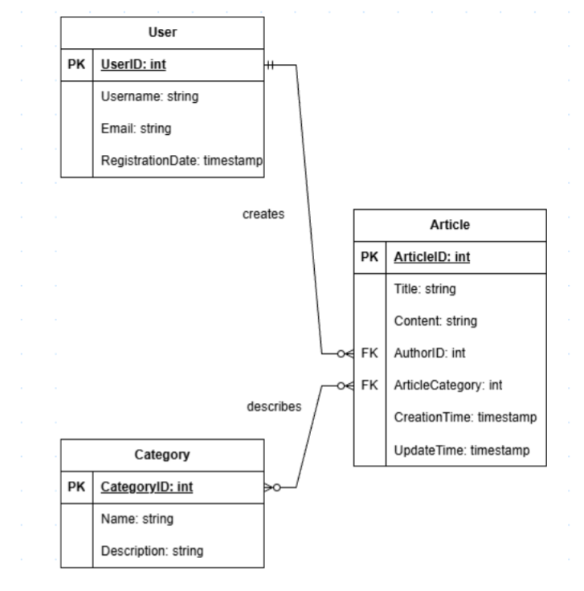

# Лабораторна робота №1: ERD

### **Веб-енциклопедія** - сценарій

## I. Збір вимог
### Призначення системи
- Збір, організація та надання доступу до енциклопедичних статей.
### Завдання користувачів
Користувачі: 
- можливість читати статті.

Автори: 
- створення статей;
- редагування статей.

Адміністратори: 
- керування категоріями;
- модерація статей.

### Вимоги
- Користувач має можливість взагалі не створювати статті, створити одну або декілька статей;
- Стаття завжди матиме свого автора;
- Стаття може бути як і в одній або декількох категоріях, так і в ніякій (на стадій створення / чернетка);
- Категорія може містити в собі як декілька статей, так і нуль;

## Дані для збереження
У системі зберігатимуться такі дані:
Інформація про користувачів: 
- юзернейми; 
- електронні пошти;
- дати створення профілей;
- ідентифікатори.

Інформація про статті: 
- назви; 
- вміст;
- категорії;
- ідентифікатори авторів;
- дати створення та редагування статті.

Інформація про категорії:
- назви;
- описи.

## II. ER-діаграма
### Сутності
ER-модель веб-енциклопедії складатиметься з таких сутностей:
- **User** (Користувач)
- **Article** (Стаття)
- **Category** (Категорія)

### Атрибути
Атрибути для сутності **User**:
- **UserID** (PK) - ідентифікатор користувача;
- **Username** - юзернейм користувача;
- **Email** - електронна пошта користувача;
- **RegistrationDate** - дата реєстрації.

Атрибути для сутності **Article**:
- **ArticleID** (PK) - ідентифікатор статті;
- **Title** - назва статті;
- **Content** - вміст статті;
- **AuthorID** (FK) - ідентифікатор автора статті;
- **ArticleCategory** (FK) - категорія, в якій міститься стаття;
- **CreationTime** - час створення статті;
- **UpdateTime** - час редагування статті.

Атрибути для сутності **Category**:
- **CategoryID** (PK) - ідентифікатор категорії;
- **Name** - назва категорії;
- **Description** - опис категорії.

## Зв'язки
### User - Article
Тип: **one-to-many**.
Користувач може створити декілька статей.
Стаття може мати тільки одного автора.

### Article - Category
Тип: **many-to-many**.
Стаття може міститись в декількох категоріях.
Категорія може містити декілька статей.

## Діаграма
