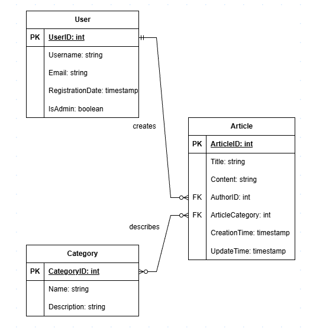
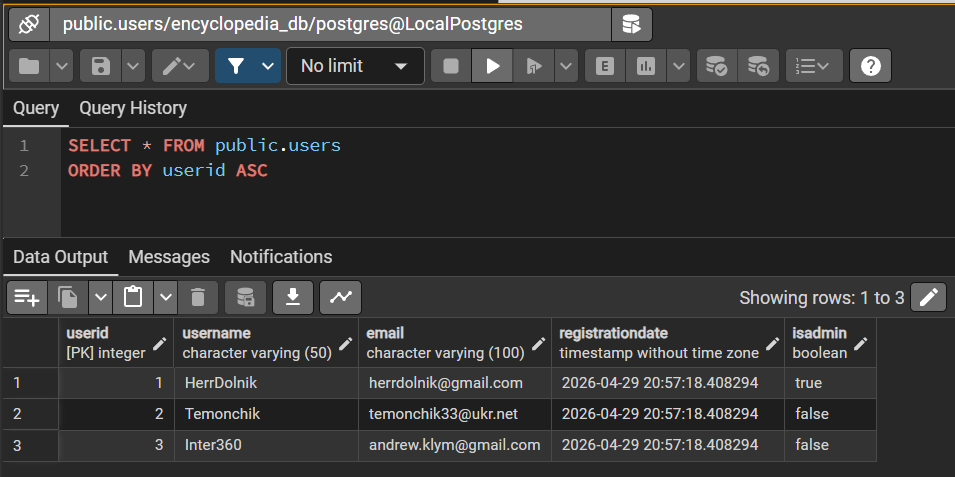
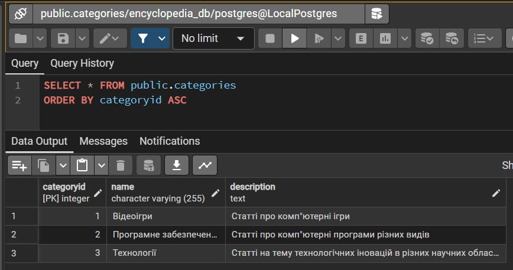
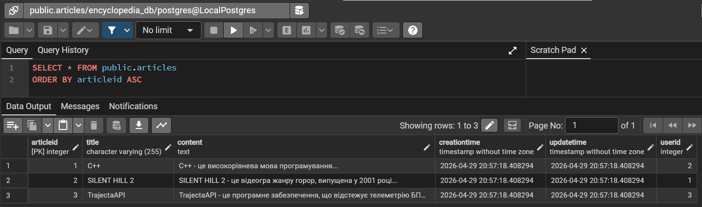
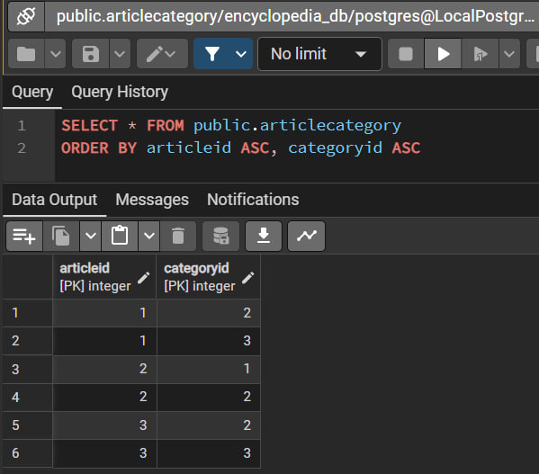

# Лабораторна робота №2: Перетворення ER-діаграми на схему PostgreSQL

## I. Огляд схеми бази даних
Дана база даних призначена для зберігання інформації про користувачів, статі та категорії у веб-енциклопедії.

## Таблиці
Схема складається з трьох таблиць **Users**, **Categories**, **Articles** та одної розв'язувальної таблиці **ArticleCategory**.

### Таблиця Users (Користувачі):

Дана таблиця містить інформацію про користувачів.

|Атрибут|Тип даних|Обмеження|Опис|
|-------|---------|---------|----|
|**UserID**|SERIAL|PRIMARY KEY|Ідентифікатор користувача|
|**Username**|VARCHAR(50)|NOT NULL UNIQUE|Унікальний і непустий юзернейм користувача з обмеженням у 50 символів|
|**Email**|VARCHAR(100)|NOT NULL UNIQUE|Унікальна і непуста електронна пошта користувача з обмеженням у 100 символів|
|**RegistrationDate**|TIMESTAMP|DEFAULT CURRENT_TIMESTAMP|Дата реєстрації користувача|
|**IsAdmin**|BOOLEAN|DEFAULT FALSE|Наявність адміністративних привілеїв у користувача|


### Таблиця Categories (Категорії):

Дана таблиця містить інформацію про категорії.

|Атрибут|Тип даних|Обмеження|Опис|
|-------|---------|---------|----|
|**CategoryID**|SERIAL|PRIMARY KEY|Ідентифікатор категорії|
|**Name**|VARCHAR(255)|NOT NULL UNIQUE|Унікальна і непуста назва категорії з обмеженням у 255 символів|
|**Description**|TEXT|-|Опис категорії|


### Таблиця Articles (статті):

Дана таблиця містить інформацію про статті.

|Атрибут|Тип даних|Обмеження|Опис|
|-------|---------|---------|----|
|**ArticleID**|SERIAL|PRIMARY KEY|Ідентифікатор статті|
|**Title**|VARCHAR(255)|NOT NULL UNIQUE|Унікальна і непуста назва статті з обмеженням у 255 символів|
|**Content**|TEXT|-|Вміст статті|
|**CreationTime**|TIMESTAMP|DEFAULT CURRENT_TIMESTAMP|Час створення статті|
|**UpdateTime**|TIMESTAMP|DEFAULT CURRENT_TIMESTAMP|Час оновлення статті|
|**UserID**|INTEGER|NOT NULL FOREIGN KEY|Посилання на ідентифікатор автора статті|

### Таблиця ArticleCategory (Категорія статті):

Дана розв'язувальна таблиця містить інформацію про те, в яких категоріях містяться статті (реалізація зв'язку many-to-many).

|Атрибут|Тип даних|Обмеження|Опис|
|-------|---------|---------|----|
|**(ArticleID, CategoryID)**|(INTEGER, INTEGER)|PRIMARY KEY|Унікальна пара статті і категорії|
|**ArticleID**|INTEGER|NOT NULL FOREIGN KEY|Посилання на ідентифікатор статті з можливістю видалення|
|**CategoryID**|INTEGER|NOT NULL FOREIGN KEY|Посилання на ідентифікатор категорії з можливістю видалення|

> Первинний ключ (ArticleID, CategoryID) потрібен, щоб одна стаття перебувала в одній конкретній категорії в унікальному екземплярі.

## ER-діаграма


## II. SQL-скрипт створення та наповнення даними
```sql
-- Створення таблиць
-- Таблиця користувачів
CREATE TABLE Users (
	UserID SERIAL PRIMARY KEY,
	Username VARCHAR(50) NOT NULL UNIQUE,
	Email VARCHAR(100) NOT NULL UNIQUE,
	RegistrationDate TIMESTAMP DEFAULT CURRENT_TIMESTAMP,
	IsAdmin BOOLEAN DEFAULT FALSE
);
-- Таблиця категорій
CREATE TABLE Categories (
	CategoryID SERIAL PRIMARY KEY,
	Name VARCHAR(255) NOT NULL UNIQUE,
	Description TEXT
);
-- Таблиця статей
CREATE TABLE Articles (
	ArticleID SERIAL PRIMARY KEY,
	Title VARCHAR(255) NOT NULL,
	Content TEXT NOT NULL,
	CreationTime TIMESTAMP DEFAULT CURRENT_TIMESTAMP,
	UpdateTime TIMESTAMP DEFAULT CURRENT_TIMESTAMP,
	UserID INTEGER NOT NULL,
	FOREIGN KEY (UserID) REFERENCES Users(UserID)
);
-- Реалізація співвідношення Many-to-many у Articles-Categories
CREATE TABLE ArticleCategory (
	ArticleID INTEGER NOT NULL,
	CategoryID INTEGER NOT NULL,
	PRIMARY KEY (ArticleID, CategoryID),
	FOREIGN KEY (ArticleID) REFERENCES Articles(ArticleID) ON DELETE CASCADE,
	FOREIGN KEY (CategoryID) REFERENCES Categories(CategoryID) ON DELETE CASCADE
);
-- Наповнення даними
-- Наповнення користувачами
INSERT INTO Users (Username, Email, IsAdmin) VALUES
('HerrDolnik', 'herrdolnik@gmail.com', TRUE),
('Temonchik', 'temonchik33@ukr.net', FALSE),
('Inter360', 'andrew.klym@gmail.com', FALSE);
-- Наповнення категоріями
INSERT INTO Categories (Name, Description) VALUES
('Відеоігри', 'Статті про комп"ютерні ігри'),
('Програмне забезпечення', 'Статті про комп"ютерні програми різних видів'),
('Технології', 'Статті на тему технологічних іновацій в різних научних областях');
-- Наповнення статями
INSERT INTO Articles (Title, Content, UserID) VALUES
('C++', 'C++ - це високорівнева мова програмування...', 2),
('SILENT HILL 2', 'SILENT HILL 2 - це відеогра жанру горор, випущена у 2001 році...', 1),
('TrajectaAPI', 'TrajectaAPI - це програмне забезпечення, що відстежує телеметрію БПЛА...', 3);
-- Зв'язання статей та категорій
INSERT INTO ArticleCategory (ArticleID, CategoryID) VALUES
(1, 2),
(1, 3),
(2, 1),
(2, 2),
(3, 2),
(3, 3);
```

## III. Створені таблиці в PostgreSQL

### Users

### Categories

### Articles

### ArticleCategory
