# Лабораторна робота №3: OLTP

## I. SELECT

### 1.1 Показ всіх користувачів
```sql
SELECT * FROM Users;
```
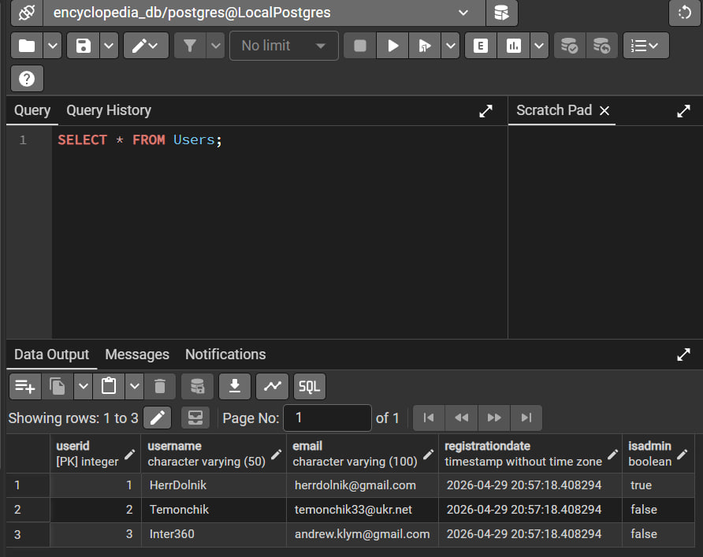

### 1.2 Показ всіх статей
```sql
SELECT * FROM Articles;
```
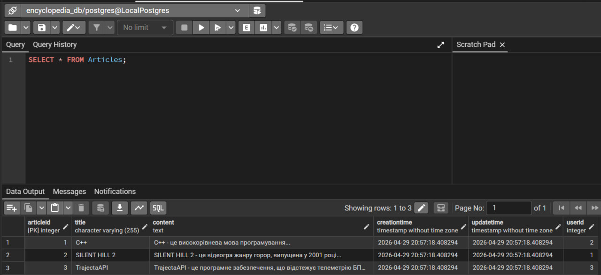

### 1.3 Показ всіх категорій
```sql
SELECT * FROM Categories;
```
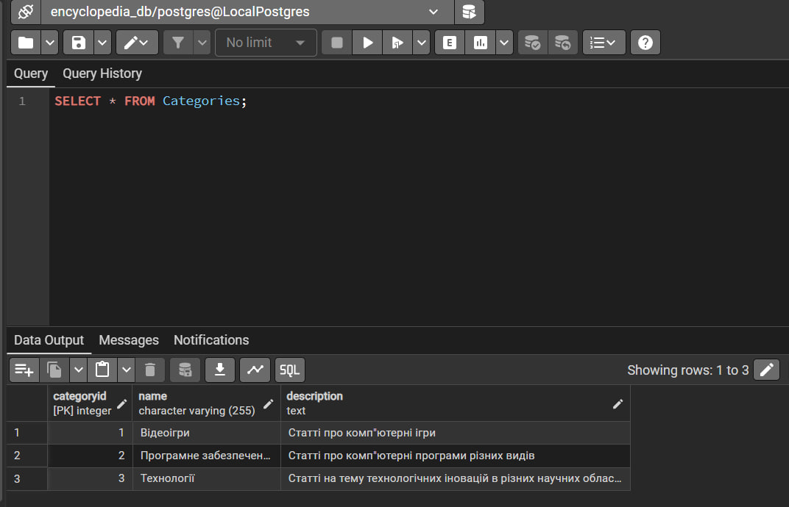

### 1.4 Показ електронних пошт всіх користувачів без адмінок
```sql
SELECT Email FROM Users
WHERE IsAdmin = FALSE;
```
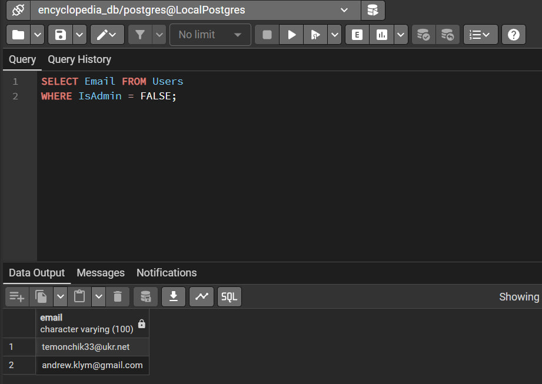

### 1.5 Показ статей від користувача з ID 3
```sql
SELECT Title, Content FROM Articles
WHERE UserID = 3;
```
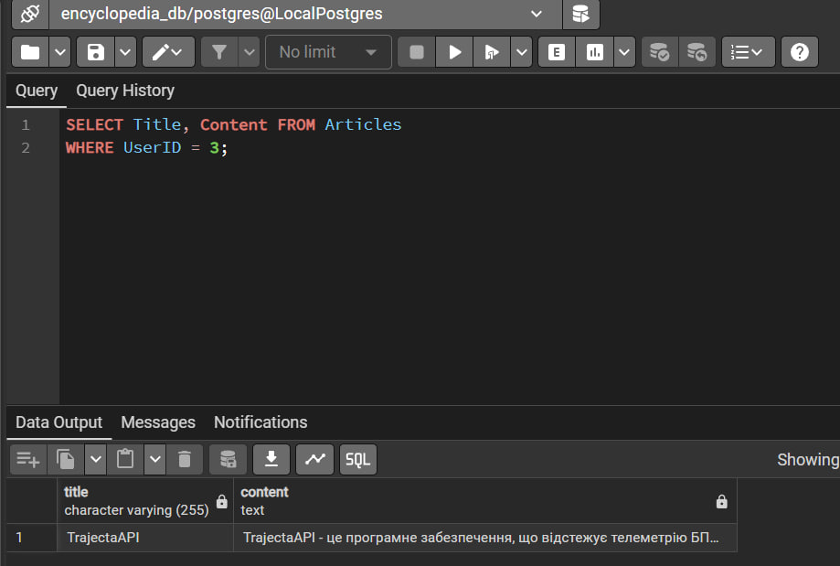

### 1.6 Показ категорій, до якиї належить стаття з ID 2
```sql
SELECT Categories.Name FROM Categories
JOIN ArticleCategory ON ArticleCategory.CategoryID = Categories.CategoryID
WHERE ArticleCategory.ArticleID = 2;
```
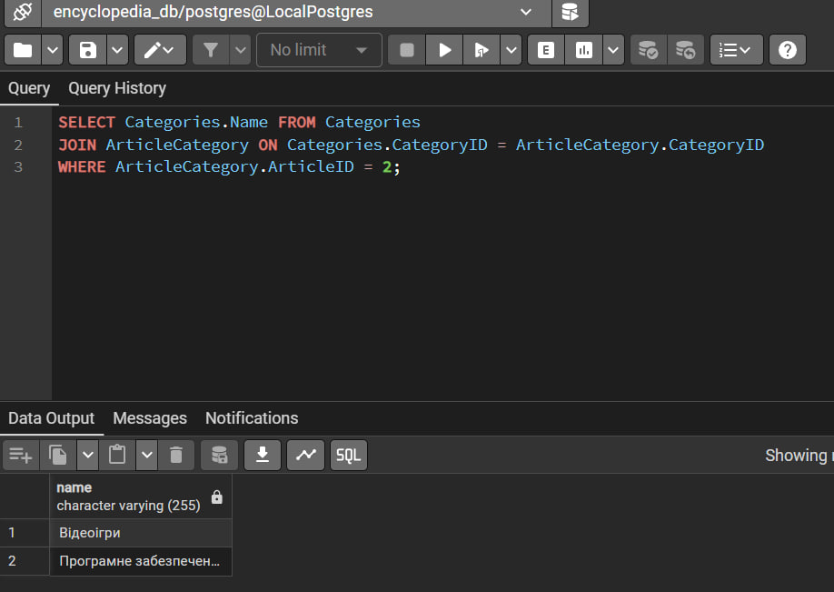

## II. INSERT

### 2.1 Додавання двох нових користувачів
```sql
INSERT INTO Users (Username, Email, IsAdmin) VALUES
('Genokiller2222', 'sasaakubin@ukr.net', TRUE),
('kanarejkaleblaaack', 'igor.chornyy@gmail.com', FALSE);
SELECT * FROM Users;
```
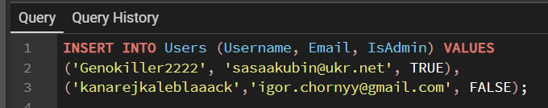
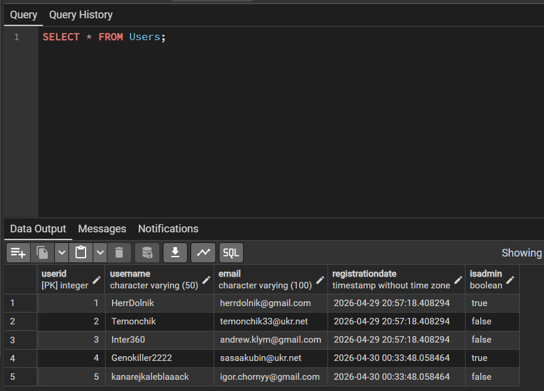

### 2.2 Додавання нової статті в таблицю та існуючі категорії
```sql
INSERT INTO Articles (Title, Content, UserID) VALUES
('Hollow Knight: Silksong', 'Hollow Knight: - це комп"ютерна інді гра, що вийшла у 2025 році...', 5);

INSERT INTO ArticleCategory (ArticleID, CategoryID) VALUES
(4, 1), (4, 2);

SELECT Title, Content, UserID FROM Articles;
SELECT * FROM ArticleCategory;
```
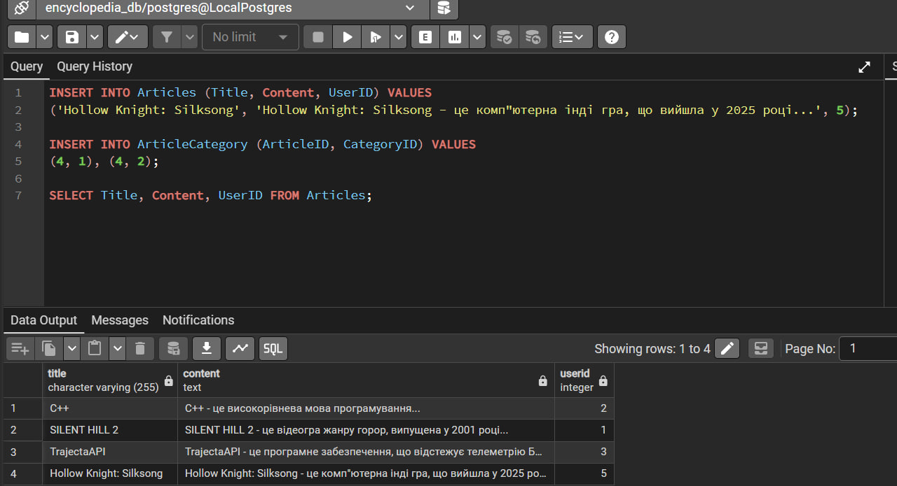
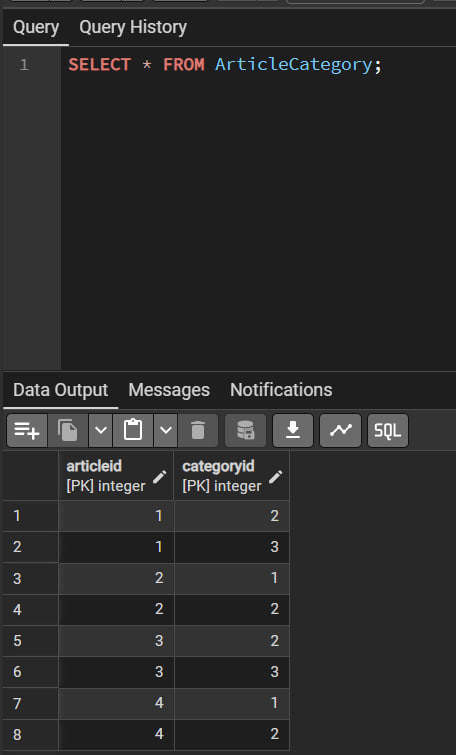


### 2.3 Додавання нової категорії
```sql
INSERT INTO Categories (Name, Description) VALUES
('Хімія', 'Статті про все, що пов"язано з хімією: науковці, закони і т.д.');

SELECT * FROM Categories;
```
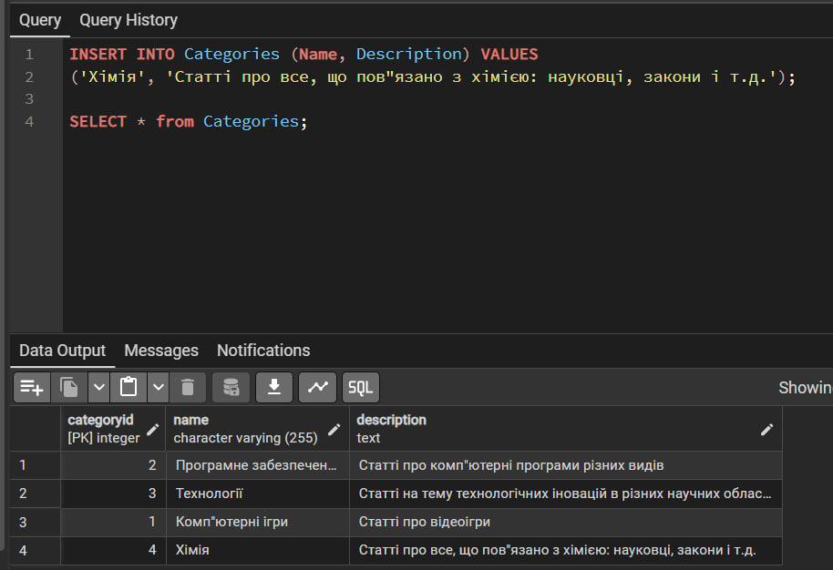

## III. UPDATE

### 3.1 Оновлення статті з ID 1
```sql
UPDATE Articles
SET Content = 'C++ фігня, а от Java - ось це вже інша розмова',
UpdateTime = CURRENT_TIMESTAMP
WHERE ArticleID = 1;

SELECT * FROM Articles
WHERE ArticleID = 1;
```
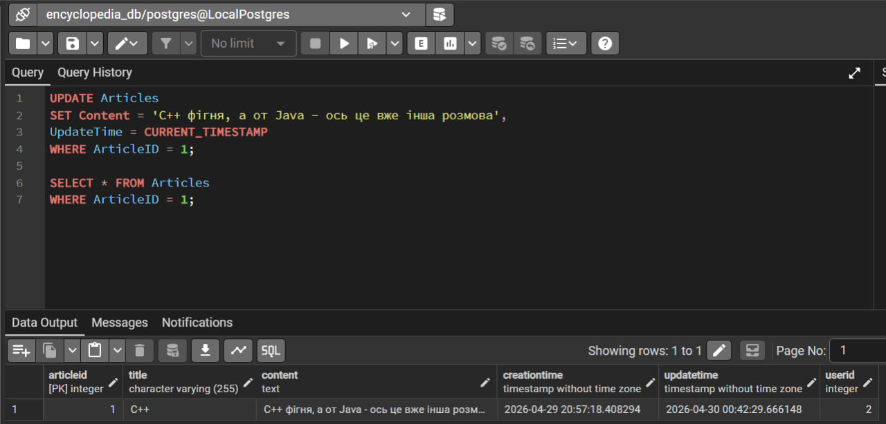

### 3.2 Видача користувачу з ID 3 адмінськиї прав
```sql
UPDATE Users
SET IsAdmin = TRUE
WHERE UserID = 3;

SELECT * FROM Users;
```
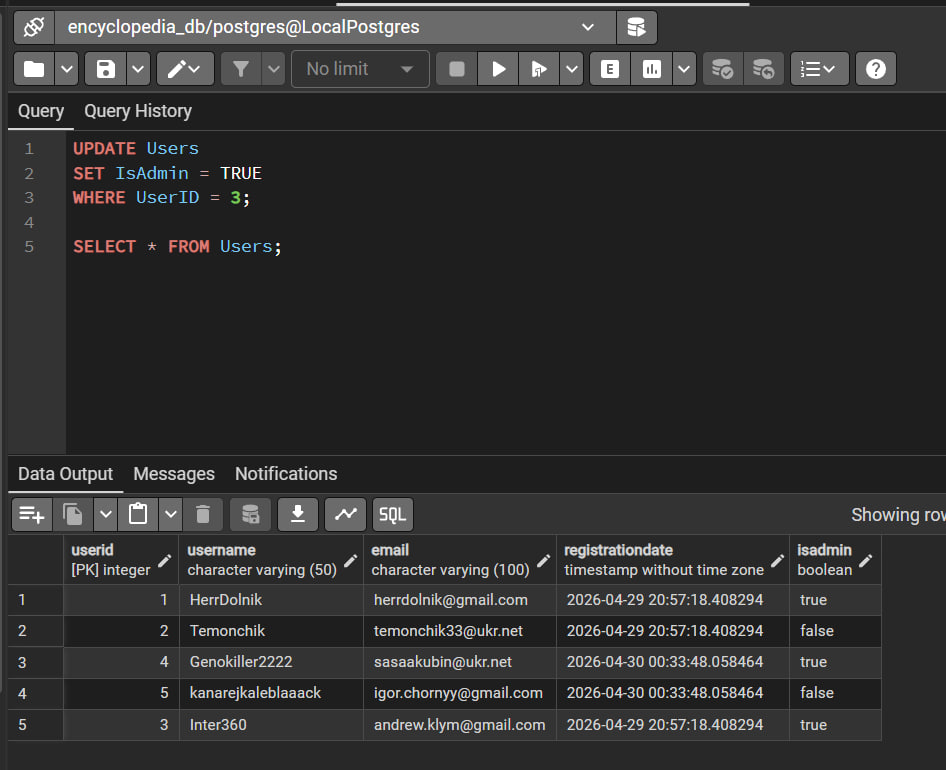

### 3.3 Коректування назви та опису категорії
```sql
UPDATE Categories
SET Name = 'Комп"ютерні ігри', Description = 'Статті про відеоігри'
WHERE CategoryID = 1;

SELECT Name, Description from Categories;
```
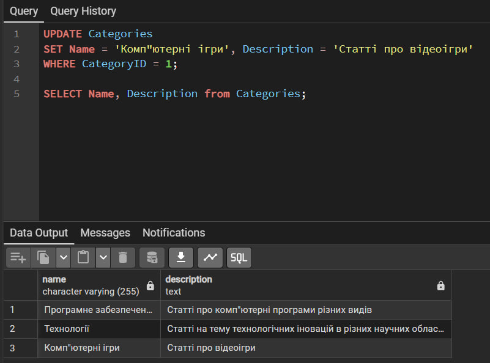

## IV. DELETE

### 4.1.1 Помилка видалення користувача через те, що стаття ще існує
```sql
DELETE FROM Users
WHERE Users.UserID = 2;

SELECT * FROM Users;
```
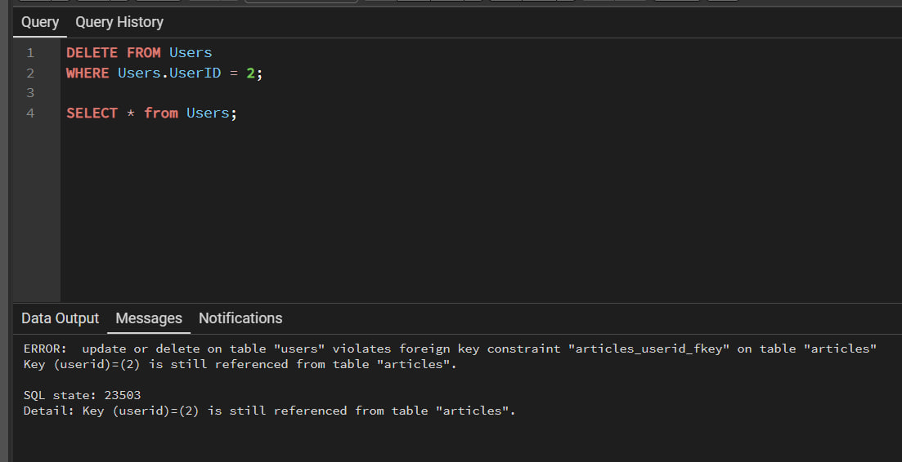

### 4.2 Видалення статей користувача з ID 2
```sql
DELETE FROM Articles
WHERE UserID = 2;

SELECT * FROM Articles;
```
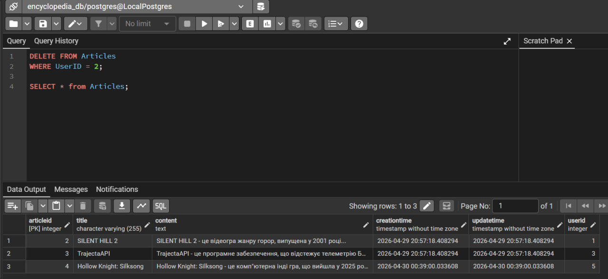

### 4.1.2 Видалення користувача з ID 2
```sql
DELETE FROM Users
WHERE UserID = 2;

SELECT * FROM Users;
```
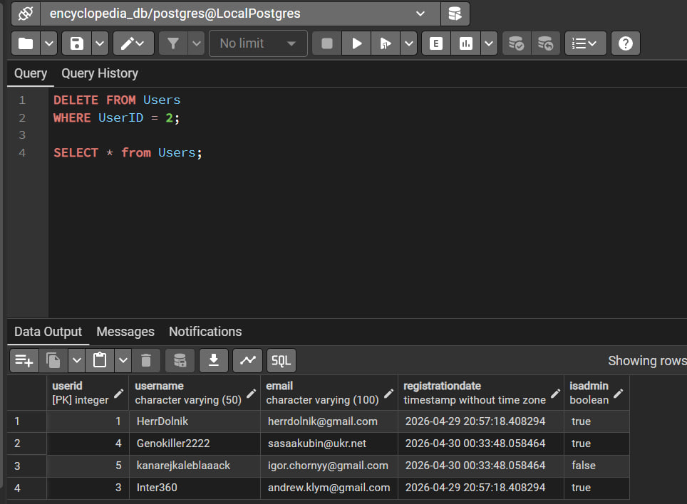

### 4.3 Видалення категорії "Хімія"
```sql
DELETE FROM Categories
WHERE Name = 'Хімія';

SELECT * FROM Categories;
```
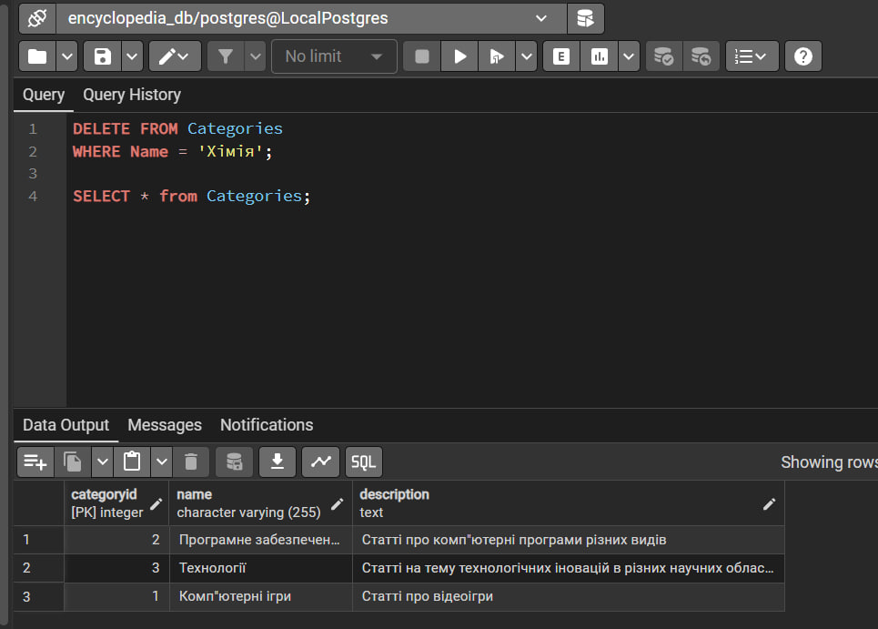

### 4.4 Видалення статті з ID 2 зі всіх категорій
```sql
DELETE FROM ArticleCategory
WHERE ArticleID = 2;

SELECT * FROM ArticleCategory;
```
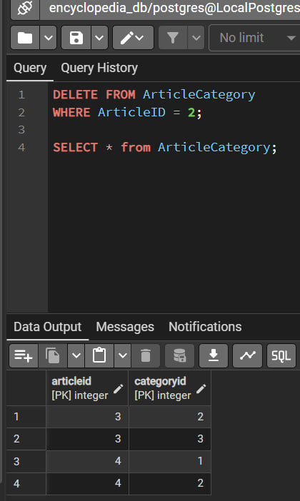

## Висновок
На даній лабораторній роботи я виконував OLTP-виклики в базі даних. По ходу її виконання я практикував виклики таблиці та їх окремі елементів, вставлення нових елементів у таблиці, зміни уже існуючих елементів, а також видалення елементів з таблиць. При маніпуляціях з таблицями в базі даних проблем не виникло.