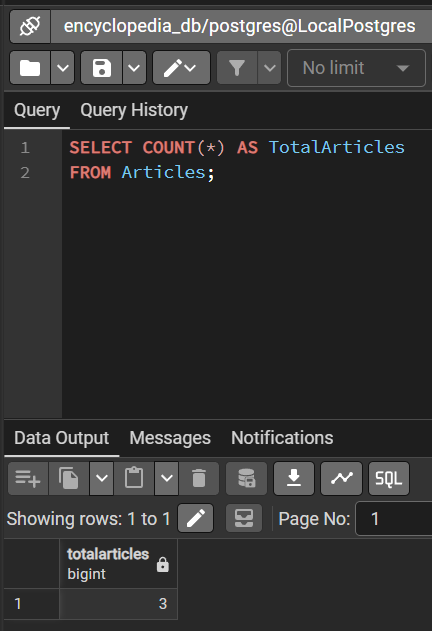
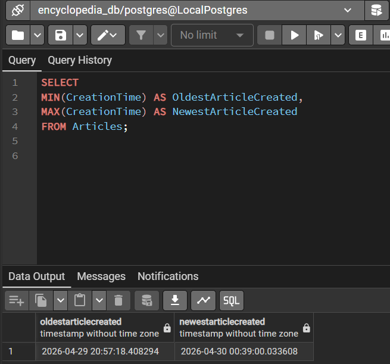
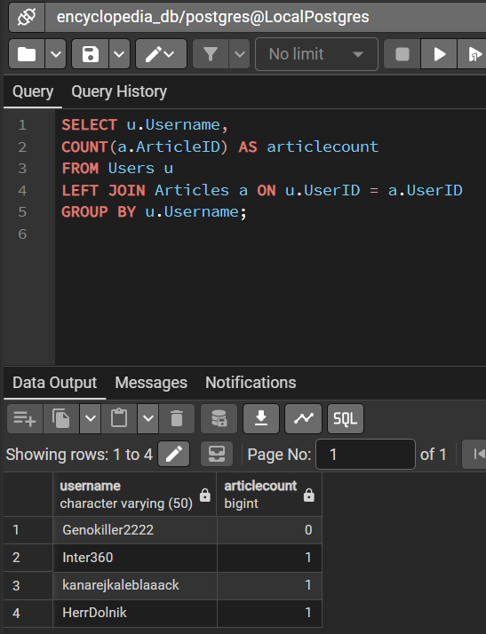
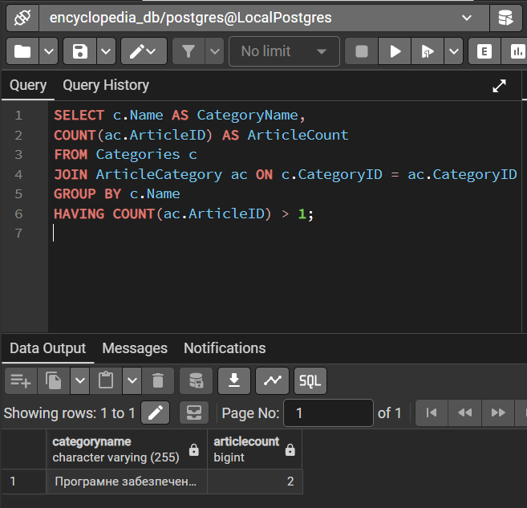
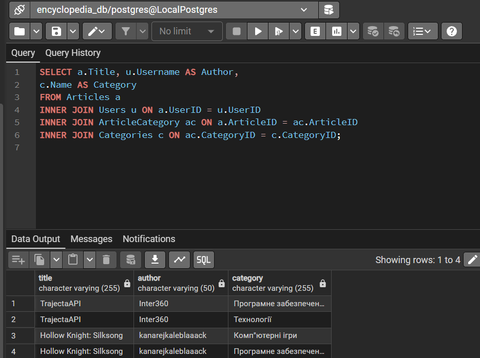
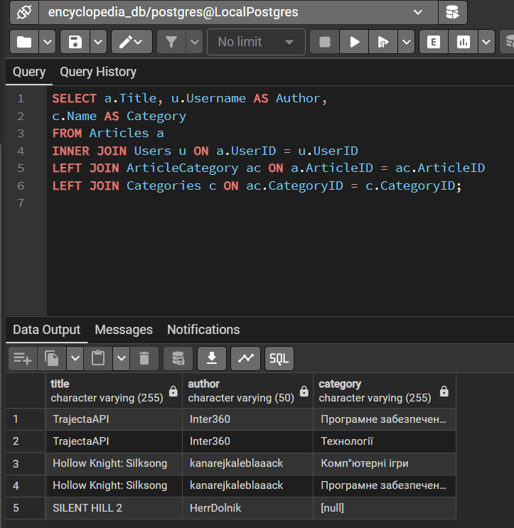
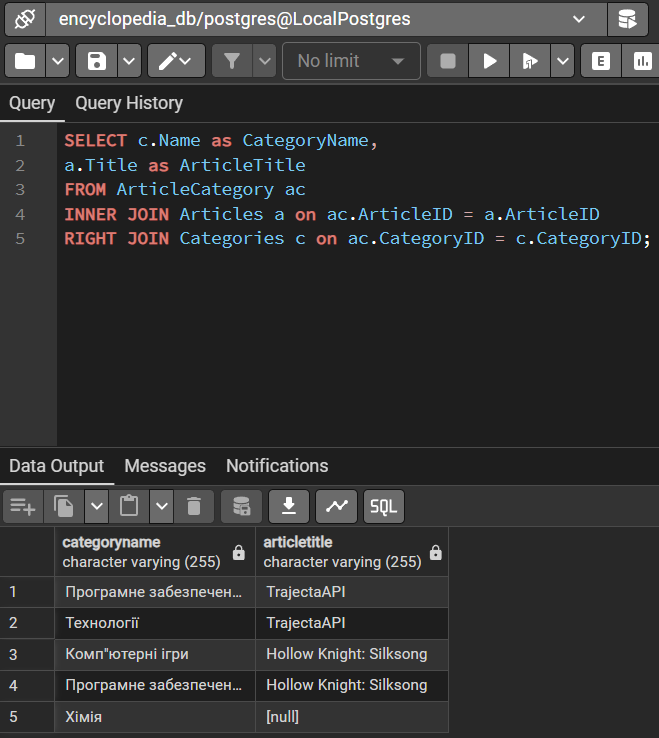
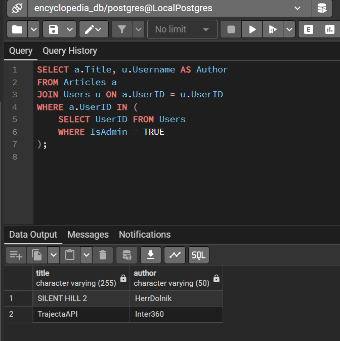
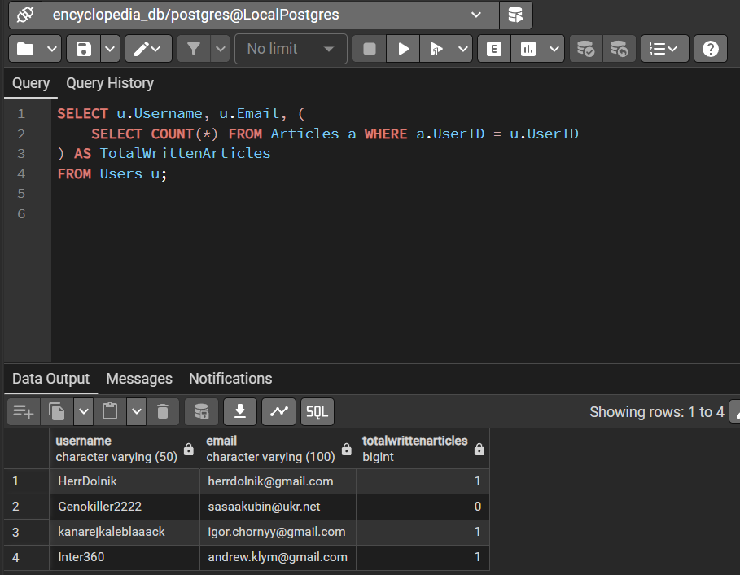
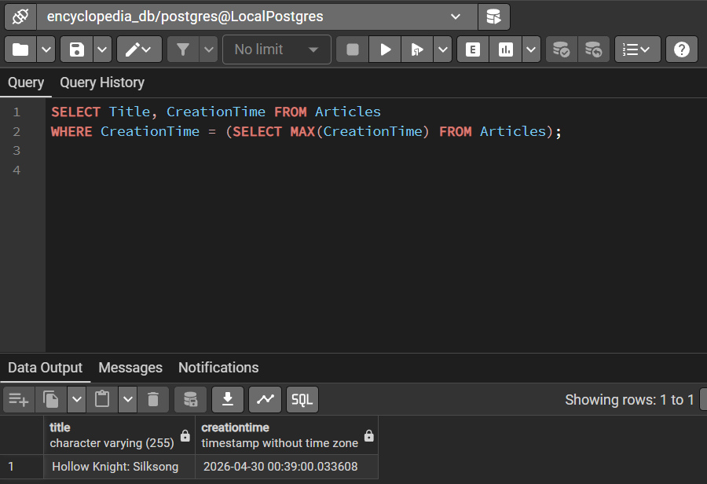

# Лабораторна робота №4: OLAP

## I. Агрегатні функції

### 1.1 COUNT: Підрахунок всіх статей в енциклопедії
```sql
SELECT COUNT(*) AS TotalArticles
FROM Articles;
```


### 1.2 MIN/MAX: Визначення дат створення найстарішої та найновішої статей в енциклопедії
```sql
SELECT 
MIN(CreationTime) AS OldestArticleCreated,
MAX(CreationTime) AS NewestArticleCreated
FROM Articles;
```


### 1.3 GROUP BY: Групування користувачів та кількості статей, які вони написали
```sql
SELECT u.Username,
COUNT(a.ArticleID) AS articlecount 
FROM Users u
LEFT JOIN Articles a ON u.UserID = a.UserID
GROUP BY u.Username;
```


### 1.4 HAVING: Визначення категорії, в якій більше ніж 1 стаття
```sql
SELECT c.Name AS CategoryName,
COUNT(ac.ArticleID) AS ArticleCount
FROM Categories c
JOIN ArticleCategory ac ON c.CategoryID = ac.CategoryID
GROUP BY c.Name
HAVING COUNT(ac.ArticleID) > 1;
```


## II. Типи JOIN

### 2.1.1 INNER JOIN: Виведення кожної статті з іменем її автора, що міститься хоча в одній категорії
```sql
SELECT a.Title, u.Username AS Author,
c.Name AS Category
FROM Articles a
INNER JOIN Users u ON a.UserID = u.UserID
INNER JOIN ArticleCategory ac ON a.ArticleID = ac.ArticleID
INNER JOIN Categories c ON ac.CategoryID = c.CategoryID;
```


> Як можна помітити, у нас виводяться тільки ті статті, які містяться хоча б одній категорії. Але у нас присутня одна стаття, яка не прив'язана ні до одної категорії. Якщо ми бажаємо відобразити і цю статтю, то при приєднанні таблиць ArticleCategory i Categories потрібно буде використати LEFT JOIN, щоб враховувалась та стаття, у якої ще нема ні одної категорії.

### 2.1.2 LEFT JOIN: Виведення кожної статті з іменем її автора та категорією
```sql
SELECT a.Title, u.Username AS Author,
c.Name AS Category
FROM Articles a
INNER JOIN Users u ON a.UserID = u.UserID
LEFT JOIN ArticleCategory ac ON a.ArticleID = ac.ArticleID
LEFT JOIN Categories c ON ac.CategoryID = c.CategoryID;
```


### 2.2 RIGHT JOIN: Виведення кожної категорії та кожної прив'язаної до неї статті
```sql
SELECT c.Name as CategoryName,
a.Title as ArticleTitle
FROM ArticleCategory ac
INNER JOIN Articles a on ac.ArticleID = a.ArticleID
RIGHT JOIN Categories c on ac.CategoryID = c.CategoryID;
```


## III. Підзапити

### 3.1 WHERE підзапит: Виведення кожної статті, чий автор є адміном, разом з іменем її відповідного автора
```sql
SELECT a.Title, u.Username AS Author
FROM Articles a
JOIN Users u ON a.UserID = u.UserID
WHERE a.UserID IN (
	SELECT UserID FROM Users
	WHERE IsAdmin = TRUE
);
```


### 3.2 SELECT підзапит: Виведення користувачів та кількості написаних ними статей
```sql
SELECT u.Username, u.Email, (
	SELECT COUNT(*) FROM Articles a WHERE a.UserID = u.UserID 
) AS TotalWrittenArticles
FROM Users u;
```


### 3.3 WHERE підзапит з агрегацією: Знаходження статті, яка була створена найостаннішою
```sql
SELECT Title, CreationTime FROM Articles
WHERE CreationTime = (SELECT MAX(CreationTime) FROM Articles);
```


## Висновок
На даній лабораторній роботи я виконував OLAP-запити в базі даних. По ходу її виконання я практикував запити з агрегаціями, різними видами JOIN та підзапити з SELECT та WHERE. OLAP-запити допомагають фільтрувати інформацію в базах даних по різним критеріям, наприклад, як у мене в лабораторній роботі, визначення кількостей статей, створених кожним користувачем, визначення статей, чий автор - адмін і т.д. При формуванні OLAP-запитів у базі даних проблем не виникло.