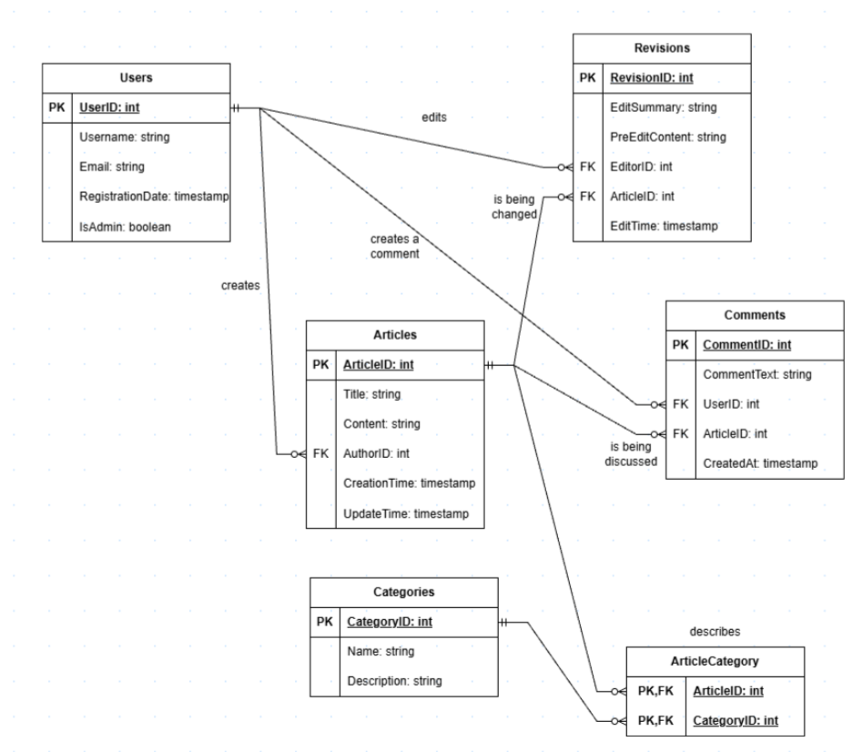

# Лабораторна робота №5: Нормалізація бази даних

### ER-діаграма, яка буде проаналізована

## I. Аналіз схеми

Проаналізуємо таблиці, які представлені на діаграмі: `Users`, `Articles`, `Categories`, `ArticleCategory`, `Revisions` та `Comments`.

## Users (Користувачі)
- Ключ: **UserID**;
- Функціональні залежності(ФЗ): `UserID -> Username, Email, RegistrationDate, IsAdmin`;
- Ім'я користувача, його електронна пошта, дата створення акаунту та наявність адмінський привілеїв залежать від ідентифікатора користувача.

## Articles (Статті)
- Ключ: **ArticleID**;
- Функціональні залежності(ФЗ): `ArticleID -> Title, Content, AuthorID, CreationTime, UpdateTime`;
- Назва, вміст на дані про створення статті залежать від її ID.

## Categories (Категорії)
- Ключ: **CategoryID**;
- Функціональні залежності(ФЗ): `CategoryID -> Name, Description`;
- Назва та опис категорії залежать від її ID.

## ArticleCategory (Категорія статті)
- Ключ: **(ArticleID, CategoryID) - складений ключ**;
- Неключові атрибути у даній таблиці відсутні.

## Revisions (Ревізії)
- Ключ: **RevisionID**;
- Функціональні залежності(ФЗ): `RevisionID -> EditSummary, PreEditContent, EditorID, ArticleID, EditTime`;
- Підсумок ревізії, вміст перед редагування, ID статті та її редактора і час внесення змін залежать від ID ревізії.

## Comments (Коментарі)
- Ключ: **CommentID**;
- Функціональні залежності(ФЗ): `CommentID -> CommentText, UserID, ArticleID, CreatedAt`;
- Вміст, дата створення коментаря та ідентифікатори статті, під якою був написаний коментар, і автора коментаря залежать від ID коментаря.

## II. Перевірка нормальних вимог

### 1NF: Перша нормальна форма

**Вимога**: Усі атрибути повинні бути атомарними, а кожен рядок — унікальним.

**Аналіз**: Ревізії (`Revisions`), коментарі (`Comments`) та категорії (`Categories`) не зберігаються списком у таблиці статті (`Articles`), бо вони вже представлені окремими таблицями, а декілька категорій, до яких може належати одна стаття, реалізовані у вигляді розв'язувальної таблиці `ArticleCategory`.

**Висновок**: Усі таблиці знаходяться в 1NF.

### 2NF: Друга нормальна форма

**Вимога**: Належність до 1NF та відсутність часткових залежностей.

**Аналіз**: Майже всі таблиці, представлені у схемі, мають лише одинарний ключ, тому часткова залежність у них неможлива. `ArticleCategory` - єдина таблиця зі складеним ключем, але часткова залежність не відбувається через відсутність неключових елементів у таблиці.

**Висновок**: Усі таблиці знаходяться в 2NF.

### 3NF: Третя нормальна форма

**Вимога**: Належність до 2NF та відсутність транзитивних залежностей.

**Аналіз**: Таблиця `Articles` має зовнішній ключ `AuthorID`, а вся інформація про автора зберігається в таблиці `Users`. Аналогічно, у таблиці `Comments` дані про користувача, що залишив коментар, та статтю, де кометар був залишений, пов'язані через зовнішні ключі `UserID` та `ArticleID`, тому транзитивні залежності у таблицях відсутні. 

**Висновок**: Усі таблиці знаходяться в 3NF.

## Висновок по лабораторній роботі
На даній лабораторній роботи я виконував аналіз різних видів залежностей у базі даних та визначав нормальні форми, до яких належить схема на основі цих залежностей. У результаті вийшло так, що побудована схема знаходиться у третій нормальній формі через те, що дані у базі даних не дублюються і зберігаються лише в одній таблиці.