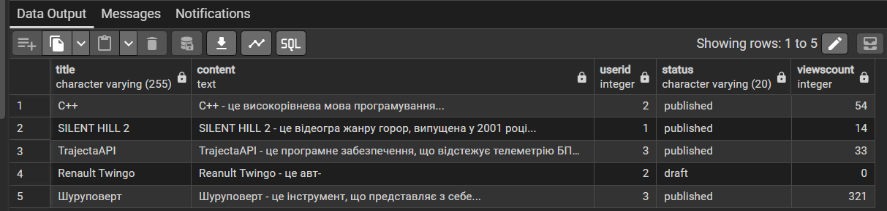
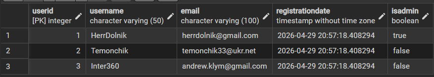
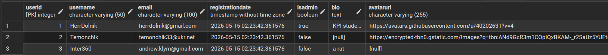
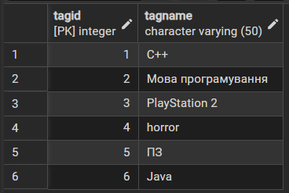
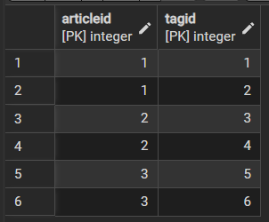
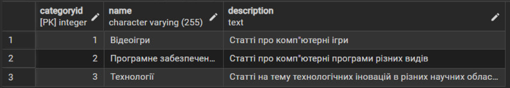
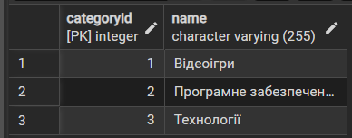
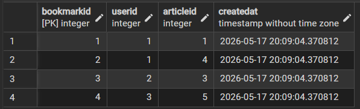

# Лабораторна робота №6: Міграції за допомогою Flyway

## Список міграцій
|Версія|Назва міграції|
|------|--------------|
|**V2**|add_columns_to_articles|
|**V3**|add_columns_to_users|
|**V4**|create_tags_table|
|**V5**|delete_description_column_from_categories|
|**V6**|create_bookmarks_table|

## V2 - add columns to articles

### Зміни
- Було додано атрибут `Status`, щоб у базі даних можна було відслідковувати статус статті (чернетка або опублікована);
- Було додано атрибут `ViewCount` для відстеження кількості переглядів на статті.

### V2__add_columns_to_articles.sql
```sql
ALTER TABLE Articles
    ADD COLUMN Status VARCHAR(20) DEFAULT 'published',
    ADD COLUMN ViewsCount INTEGER DEFAULT 0;
```

### Таблиця до міграції
```sql
SELECT * FROM Articles;
```


### Таблиця після міграції
```sql
SELECT Title, Content, UserID, Status, ViewsCount FROM Articles;
```


## V3 - add columns to users

### Зміни
- Було додано атрибут `Bio`, щоб користувач мав змогу написати інформацію у себе в профілі;
- Було додано атрибут `AvatarURL`, щоб користувач мав змогу поставити собі аватарку.

### V3__add_columns_to_users.sql
```sql
ALTER TABLE Users
    ADD COLUMN Bio TEXT,
    ADD COLUMN AvatarURL VARCHAR(255);
```
### Таблиця до міграції
```sql
SELECT * FROM Users;
```


### Таблиця після міграції
```sql
SELECT * FROM Users;
```


## V4 - create tags table

### Зміни
- Було створено нову таблицю `Tags` для імплементації системи тегів, які є гнучкішими за категорії;
- Було створено розв'язувальну таблицю `ArticleTags` для прив'язки таблиці `Tags` до таблиці `Articles`;
- Зв'язок ,багато-до-багатьох: один тег може належати багатьом статтням, а одна стаття може мати багато тегів.

### V4__create_tags_table.sql
```sql
CREATE TABLE Tags (
    TagID SERIAL PRIMARY KEY,
    TagName VARCHAR(50) NOT NULL UNIQUE
);

CREATE TABLE ArticleTags (
    ArticleID INTEGER NOT NULL,
    TagID INTEGER NOT NULL,
    PRIMARY KEY (ArticleID, TagID),
    FOREIGN KEY (ArticleID) REFERENCES Articles(ArticleID) ON DELETE CASCADE,
    FOREIGN KEY (TagID) REFERENCES Tags(TagID) ON DELETE CASCADE
);
```
### Нові таблиці
```sql
SELECT * FROM Tags;

SELECT * FROM ArticleTags;
```



## V5 - delete description column from categories

### Зміни
- Було прибрано атрибут `Description` з таблиці `Categories`, бо назви достатньо для ідентифікації.

### V5__delete_description_column_from_categories.sql
```sql
ALTER TABLE Categories
    DROP COLUMN Description;
```

### Таблиця до міграції
```sql
SELECT * FROM Categories;
```


### Таблиця після міграції
```sql
SELECT * FROM Categories;
```


## V6 - create bookmarks table

### Зміни
- Було створено нову таблицю `Bookmarks`, щоб користувачі могли додати улюблені статті в закладки;
- Зв'язок з `Users` один-до-багатьох: користувач може додати декілька статей у закладки, але ці закладки прив'язані до одного користувача;
- Зв'язок з `Articles` один-до-багатьох: стаття може бути додана до закладок багато разів, але запис в таблиці посилатиметься на одну конкретну статтю.

### V6__create_bookmarks_table.sql
```sql
CREATE TABLE Bookmarks (
    BookmarkID SERIAL PRIMARY KEY,
    UserID INTEGER NOT NULL,
    ArticleID INTEGER NOT NULL,
    CreatedAt TIMESTAMP DEFAULT CURRENT_TIMESTAMP,
    FOREIGN KEY (UserID) REFERENCES Users(UserID) ON DELETE CASCADE,
    FOREIGN KEY (ArticleID) REFERENCES Articles(ArticleID) ON DELETE CASCADE
);
```
### Нова таблиця
```sql
SELECT * FROM Bookmarks;
```


## Висновок
На даній лабораторній роботи я виконував міграції схем за допомогою Flyway. По ходу її виконання я успішно створив дві нові таблиці, одну розв'язувальну таблицю, додав атрибути до існуючих таблиць та видалив атрибут в таблиці через міграції.